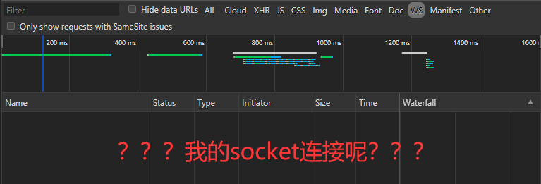

# UNIAPP使用SockJS和StompJS不完全指北

## 前言

**如果只是初步使用websocket进行一些简单的业务逻辑交互，此文章可以直接跳过，它将不会给你带来太多的帮助。**

**如果只是初步使用websocket进行一些简单的业务逻辑交互，此文章可以直接跳过，它将不会给你带来太多的帮助。**

**如果只是初步使用websocket进行一些简单的业务逻辑交互，此文章可以直接跳过，它将不会给你带来太多的帮助。**

***重要的事情说三遍***

***本文内容较多，主要是一些试错的全过程，并且全程在小程序开发工具上测试***

因为我司在PC端的项目使用的SockJS+Stomp构建的websocket消息体系，所以在使用UNIAPP构建小程序时应保留该特性，来保证项目的统一完整性。

啥玩意？UNIAPP的websocket不香吗？不好吗？用个锤子的SockJS+Stomp？

我相信，大多数朋友拿到这个需求的时候第一反应是这个，但是又有什么办法呢，我仅仅是一个为了生活而屈服的码农而已。

## 开始

刚开始，想着无非是使用两个库，通过NPM的方式加载两个库，然后根据文档一步步的配置不就OK了吗？这不是So easy，直接动手。

### 1、通过NPM引用两个JS库

具体操作请参照UNIAPP官网[NPM支持](https://uniapp.dcloud.io/frame?id=npm%e6%94%af%e6%8c%81)

通过Yarn或者NPM安装sockjs-client以及stompjs

```bash
yarn add sockjs-client stompjs
```

很容易就可以将这两个库加入我们的小程序中，是不是很简单，接下来就是按部就班的引用和配置了。我们在App.vue中加入如下代码：

```javascript
import Stomp from 'stompjs'
import SockJS from "sockjs-client";

onLoad() {
  const websocket = new SockJS("ws://websocket");
  const stompClient = Stomp.over(websocket);
  stompClient.connect(
    {},
    (res) => {
        console.log(res)
    },
    (error) => {
        console.error('error', error)
    }
  );
}
```

心想着，这么简单的活我要了一整天，今天看来又能愉快的划水摸鱼了，开开心心的在开发工具中运行我们的程序。



然后我一脸懵的看着这个调试工具，我的socket连接呢？？？算了，一次不成功也没啥，好事多磨嘛，先去console里面看看有没有什么异常。


UNIAPP里面调用原生JS的DOM操作？？？作死也不是这样作死的好吗？谁都知道小程序里面没有原生的DOM操作！！！不过，额，好像这两个库也没说支持小程序把....作孽啊！！！

看了看手机里面某呗还款的提醒，哎......一分钱，难倒英雄汉。

看到报错信息中报错的地方貌似是SockJS中的JsonpReceiver，SockJS为啥会有Jsonp？？？这玩意不是一个WebSocket库吗？

> 该死，没看文档就上手，果然就连一步都走不出去

老老实实去看看SockJS的[文档](https://github.com/sockjs/sockjs-client)吧

> 原来SockJS是一个兼容库，可以在任意环境，不管对于WebSocket是支持还是不支持，都能够通过它去连接一个Sock-server服务器，通过一些办法可以达到消息推送的目的

> 其中对于构造函数SockJS，在实例化的过程中除了必要的url外，还有两个可选的参数，其中最后一个参数为一个对象，对于这个对象的解释，原文如下

Where `options` is a hash which can contain:

- **server (string)**

  String to append to url for actual data connection. Defaults to a random 4 digit number.

- **transports (string OR array of strings)**

  Sometimes it is useful to disable some fallback transports. This option allows you to supply a list transports that may be used by SockJS. By default all available transports will be used.

- **sessionId (number OR function)**

  Both client and server use session identifiers to distinguish connections. If you specify this option as a number, SockJS will use its random string generator function to generate session ids that are N-character long (where N corresponds to the number specified by **sessionId**). When you specify this option as a function, the function must return a randomly generated string. Every time SockJS needs to generate a session id it will call this function and use the returned string directly. If you don't specify this option, the default is to use the default random string generator to generate 8-character long session ids.

- **timeout (number)**

  Specify a minimum timeout in milliseconds to use for the transport connections. By default this is dynamically calculated based on the measured RTT and the number of expected round trips. This setting will establish a minimum, but if the calculated timeout is higher, that will be used.

总算是找到你了，我们可以看到transports可以定义传输协议，默认情况下为全协议，这样SockJS会在内部自动进行判断，那么，会不会是因为SockJS无法判定小程序环境，从而没有使用WebSocket而采用了其他的协议进行消息推送呢？

如果我们指定协议，是不是就会OK了？我们改动SockJS的实例化代码：

```javascript
const websocket = new SockJS("ws://websocket", [], { transports: "websocket" });
```

突然有一种强烈的感觉，这玩意不会这么简单，算了，先看看效果


叫我百晓生？这是什么鬼报错，能说点人话不？

从代码来看，这个错误是由我亲手打出来的，看了看自己打代码的手，呸，叫你贱。看起来是Stompjs中的报错，这怎么找，没办法，只能老老实实找问题。

首先去Stompjs的[文档](https://stomp-js.github.io)看看有没有调试方法，在client的API中找到[debug](https://stomp-js.github.io/api-docs/latest/classes/Client.html#debug)的方法

> By default, debug messages are discarded. To log to `console` following can be used:

```javascript
   *        client.debug = function(str) {
   *          console.log(str);
   *        };
```

> Currently this method does not support levels of log. Be aware that the output can be quite verbose and may contain sensitive information (like passwords, tokens etc.).

尝试一下，在代码中加入

```javascript
 stompClient.debug = function (debug) {
   console.debug(debug);
 };
```

再次调试


又是这坑爹的到报错，不过还好我们看到了，已经开始连接WebSocket服务器，只不过在连接的时候出现了异常。

但是，我根本不知道到底是什么原因导致了报错，陷入绝望......

突然想到了一句话

> 当你陷入绝望的时候不是真正的绝望，当你去读源码的时候才是真正的绝望。	---- by Me

所以，去瞅瞅源码吧，把报错的信息搜索一下，看看是在什么地方出错

```javascript
    Client.prototype.connect = function() {
      var args, errorCallback, headers, out;
      args = 1 <= arguments.length ? __slice.call(arguments, 0) : [];
      out = this._parseConnect.apply(this, args);
      headers = out[0], this.connectCallback = out[1], errorCallback = out[2];
      if (typeof this.debug === "function") {
        this.debug("Opening Web Socket...");
      }
      ......
```

```javascript
      this.ws.onclose = (function(_this) {
        return function() {
          var msg;
          msg = "Whoops! Lost connection to " + _this.ws.url;
          if (typeof _this.debug === "function") {
            _this.debug(msg);
          }
          _this._cleanUp();
          return typeof errorCallback === "function" ? errorCallback(msg) : void 0;
        };
      })(this);
```

我在源码中得到了这两段代码，一段是连接，一段直接关闭。

刚连接就关闭了？？？啥意思？？？connect方法前就有问题？？？

哦豁，卡住了，这可咋整

先看看两个实例对象吧，看看有没有什么能够发现的

```javascript
const websocket = new SockJS("ws://websocket", [], { transports: "websocket" });
console.log(websocket)
const stompClient = Stomp.over(websocket);
console.log(stompClient)
```

继续看看表现


我们都知道，WebSocket有用onopen，onmessage方法，但是这里为什么是null和空函数呢？？？

> 突然想到UNIAPP中的WebSocket对象和普通浏览器中的WebSocket对象好像不太一样，/(ㄒoㄒ)/~~

那SockJS是如何调用WebSocket的？？？又到了我们愉快的翻源码时刻。

```javascript
'use strict';

var Driver = global.WebSocket || global.MozWebSocket;
if (Driver) {
	module.exports = function WebSocketBrowserDriver(url) {
		return new Driver(url);
	};
} else {
	module.exports = undefined;
}
```

然后就在SockJS中找到了这段源码，熟悉JS的我们都知道，global在浏览器环境下是window

> 也就是说，我们只需要在window下使用UNIAPP的WebSocketAPI模拟出PC环境的API就够了

我们首先输出下window，看看小程序环境是否拥有window对象

```javascript
console.log(window)
console.log(window.websocket)
```


证明在小程序环境下依旧有window对象，但是无window.websocket，这样就好解决了

websocket-polyfill.js

```javascript
class WebSocketPolyfill {
  constructor(url, protocols) {
    // 创建连接
    uni.connectSocket({
      url: url,
      protocols: protocols,
    });

    // 连接开启
    uni.onSocketOpen((res) => {
      this.onopen(res);
    });

    // 连接关闭
    uni.onSocketClose((res) => {
      this.onclose(res);
    });

    // 连接异常
    uni.onSocketError((res) => {
      this.onerror(res);
    });

    // 接收消息
    uni.onSocketMessage((res) => {
      this.onmessage(res);
    });
  }

  /**
   * 连接开启
   */
  onopen(res) {}

  /**
   * 连接关闭
   */
  onclose(res) {}

  /**
   * 连接异常
   */
  onerror(res) {}

  /**
   * 接收消息
   */
  onmessage(res) {}

  /**
   * 发送消息
   */
  send(data) {
    uni.sendSocketMessage({
      data: data,
    });
  }

  /**
   * 关闭连接
   */
  close() {
    uni.closeSocket();
  }
}

export default WebSocketPolyfill;

```

然后我们在main.js中引入并使用，感觉胜利在向我招手了

```javascript
import WebSocketPolyfill from './websocket-polyfill.js'
global.WebSocket = window.WebSocket = WebSocketPolyfill;
```

再次运行程序


我们通过Stompjs看到了这段debug信息

真的是普天同庆，总算是成功了，撒花撒花撒花

不过，这个只是连接成功，我们如果发起订阅呢？继续测试

```javascript
stompClient.connect(
  {},
  (res) => {
    stompClient.subscribe("/subscribe/", (msg) => {
      console.log(msg);
    });
    console.log(res);
  },
  (error) => {
    console.error("error", error);
  }
);
```

双手合十，祈祷，一遍过，麻利麻利哄


/(ㄒoㄒ)/~~，可算是成功了

## 结语

整体看起来并没有多波澜不惊，但是实际上，试错的过程远远不止这么多，我写出来的只不过是一条正确的试错之路，感兴趣的小伙伴可以看看，或者去试一试，写的比较凌乱，也有可能有比较多的错误，请各位看官多多指教。